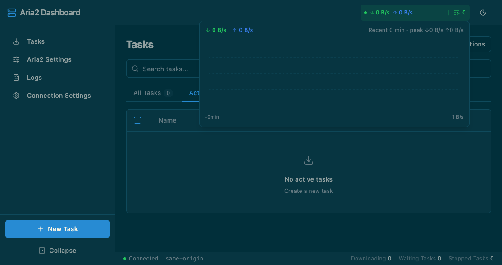
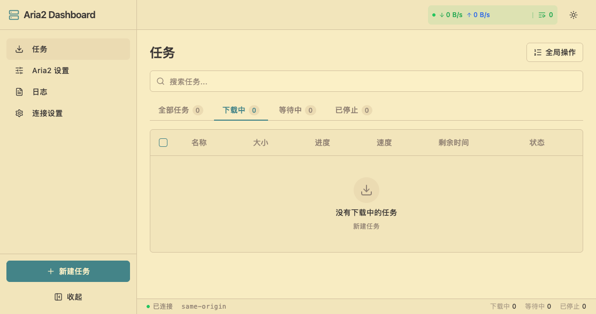
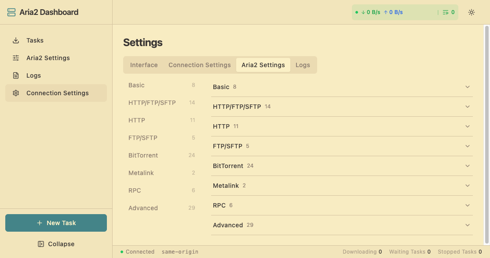

# Aria2 Dashboard

[](https://github.com/kxxoling/aria2-dashboard/actions/workflows/ci.yml)
[](https://github.com/kxxoling/aria2-dashboard/actions/workflows/release.yml)
[](./LICENSE)

A modern web dashboard and Chrome extension for the
[Aria2](https://aria2.github.io/) download manager.

## Screenshots

<details>
<summary>Screenshots (click to expand)</summary>

**Solarized Dark theme** — task list



**Gruvbox Light theme** — task list



**Gruvbox Light theme** — settings



</details>

## For Users

### Features

- **Task Management** — active/waiting/stopped lists, batch operations, live progress with ETA
- **Task Details** — per-file selective download, BT peers, task options
- **Aria2 Settings** — live editor for aria2's global options (8 categories, with read-only marking)
- **New Task** — HTTP/FTP/Magnet/torrent, multi-URL, per-task advanced options (`Cmd/Ctrl+K`)
- **Logs** — in-app aria2 log viewer with search and level filters
- **Speed Chart** — click the header rate pill for a recent speed chart
- **9 Languages** — 简体中文 · 繁體中文 · English · 日本語 · 한국어 · Español · Português · Русский · Français
- **6 Color Schemes** — Default / Solarized / Dracula / Tokyo Night / Nord / Gruvbox, each with light & dark
- **Responsive** — desktop sidebar + mobile bottom nav

### Quick Start (Docker, all-in-one)

Dashboard + aria2 in a single container — pull, run, open the page, done:

```bash
docker run -d -p 8080:80 \
  -v aria2-downloads:/data \
  -e RPC_SECRET=changeme \
  ghcr.io/kxxoling/aria2-dashboard:standalone
```

Tip: for usable BT speeds, also map the BT port with the same port inside
and outside (`-p 16900:16900 -e BT_LISTEN_PORT=16900`).

All Docker options (tracker lists, log level, basic auth, ports, the
web-UI-only image, compose stack) are documented with comments in the
[`docker/`](./docker) directory.

### Web UI only (bring your own aria2)

```bash
docker run -d -p 8080:80 \
  -e ARIA2_RPC_URL=ws://your-aria2:6800/jsonrpc \
  ghcr.io/kxxoling/aria2-dashboard:latest
```

Or run aria2 locally (`aria2c --enable-rpc`) and build from source — see
[For Developers](#for-developers).

### Chrome Extension

Grab `aria2-dashboard-extension-*.zip` from the
[latest release](https://github.com/kxxoling/aria2-dashboard/releases),
then: `chrome://extensions` → Developer mode → Load unpacked → select the
unzipped folder. Connect to any aria2 from the in-app settings.

## For Developers

```bash
bun install
bun run dev:mock      # web app with simulated data (no aria2 needed)
bun run dev           # web app against a real aria2
bun run dev:ext       # Chrome extension development
```

**Environment variables** — see [.env.example](./.env.example) (commented).

**Docker build & deployment options** — see [`docker/`](./docker) (commented).

### Commands

```bash
bun run lint          # Biome lint + format
bun run typecheck     # tsc --noEmit
bun run test          # unit tests (Vitest)
bun run test:e2e      # web e2e (Playwright, mock mode)
bun run test:ext      # extension e2e (real Chromium profile)
bun run build         # production web build
bun run build:ext     # Chrome extension build
```

Pre-commit runs lint + typecheck + unit tests. Commits follow
[Conventional Commits](https://www.conventionalcommits.org/).

### Testing Notes

- `src/mocks/fixtures*.ts` hold **real aria2 1.37.0 RPC responses** captured
  from a live daemon — keep new mocks/tests shape-compatible with them
- E2E runs in mock mode against those fixtures (fast, no daemon needed)
- Plasmo (Parcel) has resolution quirks with TanStack packages — see the
  alias in `package.json` and comments in `src/lib/isBrowser.ts` and
  `src/components/task/tableFeatures.ts` before touching those deps

## License

[MIT](./LICENSE)
